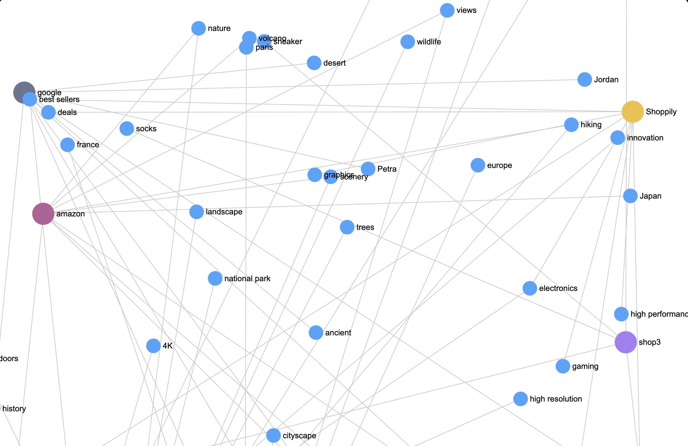

# AdGraph

AdGraph is an open, decentralized on-chain graph of user preferences.

As social and commerce shift onchain, wallets become identities. AdGraph builds onchain profiles of wallet addresses, capturing likes and preferences across all web3 apps they use. This data can used to personalize ads and content across the web3 ecosystem.

## How it works

AdGraph decentralizes and opens up the preferences of a profile. It is an onchain graph of tags where any app can add preferences for a user, for example when a user browses through the profile of a travel vlog, the app can add "travel" to the user's profile.



This profile is open, in the sense any app can add tags for their users, and can see the data added by other apps. The user can block/allow apps that are allowed to add, or can block/remove tags from their profile.

This allows decentralized apps to collaborate and contribute to the user's profile because they themselves can utilize the data added in order to target content or ads.


We built a service to demonstrate how this data can be used. Advertisers can upload a content, and we use AI to filter out the wallet addresses who will be interested in that content. The AI analyzes the content and fetches the tags, and then searches the AdGraph to find the wallet addresses who have shown interest in those tags.

A sample request of how to read from AdGraph is in the [Integrating AdGraph](#integrating-adgraph) section.

Advertiser AI sample 1   |  Advertiser AI sample 2
:-------------------------:|:-------------------------:
  |  

AdGraph can be used by the individual applications who contribute to the network to personalize their content. It can also be used by ad networks who operate across applications in order to target products to users.

# Integrating AdGraph

While using AdGraph, you will be both contributing to users' profiles, as well as consuming the data for your use cases, like targeting ads or content.

## Contributing to AdGraph

Integrating AdGraph is easy. You need to make a GET request like:

```ts
axios.get('https://hollow-kilobyte-modern.functions.on-fleek.app', {
    params: {
        profile: "<user's wallet address>",
        app: "<your app name>",
        tags: "<comma separated tags>",
        temporary_api_key: "appkey_testnet"
    }
});
```

For example,

```ts
axios.get('https://hollow-kilobyte-modern.functions.on-fleek.app', {
    params: {
        profile: "0x4bec619bf1834bbe11f334117aca57bf68f0bc2c",
        app: "shop3",
        tags: "tag1,tag2,tag3",
        temporary_api_key: "appkey_testnet"
    }
});
```

The params are passed in the URL. For testnet, the temporary_api_key is hardcoded, however for mainnet, you’ll be minted an app-specific api key, which will keep rotating.

The refresh tokens and api keys will be handled largely through our SDK which is in development.

## Reading from AdGraph

You can use your own indexers to read from AdGraph, or use our hosted subgraph.

For accessing wallet addresses interested in particular tags, you can use our subgraph endpoint for testnet with the following GraphQL query:

```graphql
query MyQuery {
  tagAddeds(
    where: {tag_in: ["laptop", "technology", "adgraph"]}
  ) {
    profile
    app
    id
    tag
  }
}
```

Endpoint: `https://api.studio.thegraph.com/proxy/80137/adgraph/v0.0.4/graphql`

We are working on more diverse and better managed services for AdGraph. Keep visiting our docs for further info.

Note: This is an alpha product, things might break. Active development is going on to help make the usage and onboarding easy. We would love to speak with anyone interested in it. Mail us at [adgraph@debjit.dev](mailto:adgraph@debjit.dev) for issues you’re facing or custom GraphQL queries you need.

# Tech we used

## Fleek functions

We use Fleek functions to handle the several tag addition requests coming from apps. The calls will be made directly from the browser, so having execution on edge is crucial. The function internally calls a function on our smart contract on Base, which is sponsored by Coinbase Paymaster.

All the transaction execution code and paymaster integration is done right from within the Fleek function. So, adding the tag to the user’s onchain profile is as easy as calling the function with the user’s address and tag. It doesn’t need any pop ups etc.

## CoinBase Paymaster

We use CoinBase Paymaster to sponsor the transactions. This is crucial for the user experience, as the user doesn’t need to pay for the transactions. The app can sponsor the transaction, and the user can just use the app without worrying about the gas fees.

This experience has been simplified down to making a simple GET request to the Fleek function, and the function internally handles the transaction and the payment.

This is done to integrate the Fleek Function in clickstream events, such as every interaction point, such as button clicks, page loads etc.

## AI wizardry

We built the whole product, but didn't know how to make an advertiser understand the problem we were solving. We solved this using AI.

We have a sample site which integrates AdGraph, and use AI where advertisers can upload content, from which we will automatically extract labels and perform searches to find the wallet addresses who will be interested in it. We show the advertisers the list of wallet addresses and which tags make them suited for the content.

## The Graph

We use The Graph for indexing the data. We have a hosted subgraph for testnet. This will make it easy for developers to read from AdGraph.

# Future Roadmap

Our contracts and core functionalities are ready. We are working on making the onboarding and usage easy. We will be simplifying the developer experience by providing SDKs for easy contribution and hosted APIs for easy consumption.

A longer term goal would be to create a service where advertisers can upload content, and we target them ourselves with the open data we have. This is similar to how Google targets ads, but in a decentralized manner.

# Notes
- Apps get discovered when they are brought in front of users who will be most interested in them.
- Using the open and decentralized nature of blockchains, we imagined an open and decentralized graph for advertisers.
- Imagine Shop3, a shopping site and Scroll, a social media. They keep publishing what the user’s interests are to their ad graph.
- When the user opens a shoe page on Scroll, “shoe” gets added to AdGraph. When Shop3 wants to advertise a shoe, it can instantly pull up wallet addresses interested in that particular tag. Maybe Shop3 can even advertise on Scroll.
- The network grows stronger as more apps join the network.
- Discovery increases for everyone, especially for new joiners who will have a host of information available at their disposal about who will be most interested in them.
- The user can of course remove certain tags or even block certain apps or tags.
- To achieve scale, the tag addition function needs to be triggered at interaction points, across buttons and page loads. We use Fleek functions to handle such clickstreams.
- The function internally publishes the data to AdGraph’s smart contracts, and all such transactions are sponsored using CoinBase’s Paymaster.
- The user’s profile page shows all the apps and the tags they have added. Here they can remove tags or block certain apps or tags.
- We also integrated AI to improve the advertiser experience. You just upload an image, we use AI to extract the tags and fetch a list of wallet addresses who will be interested in that image, along with the top matching tag for each address.